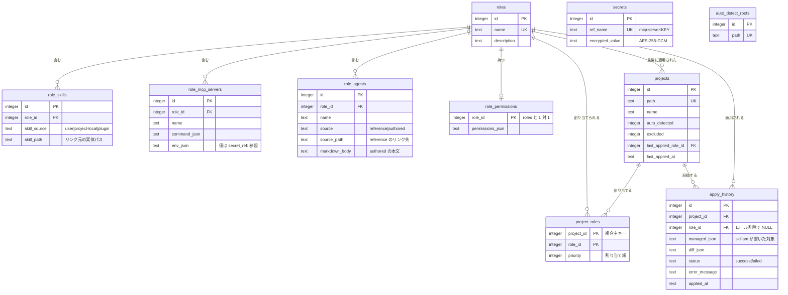

# skillam

Claude Code の設定を、IAM のロールのように管理するローカルツール。

複数のプロジェクトを横断して Claude Code を使っていると、「このディレクトリではどの Skill が使えるか」「どの MCP サーバーに繋ぐか」「どんな tool permissions を与えるか」が、プロジェクトごとに `.claude/settings.json` と `.mcp.json` へ手で書き散らされていく。skillam はそれを **ロール** という単位にまとめ、プロジェクト（ディレクトリ）へ割り当てて適用する。

「ビジネス向けハーネス」「エンジニアリング向けハーネス」をロールとして定義しておき、作業するディレクトリに付け替える、という使い方を想定している。

```
ロール（サービスアカウントのようなもの）
  ├─ Skills          ~/.claude/skills、プラグイン提供分、プロジェクト固有
  ├─ MCP サーバー     接続情報。シークレットは暗号化して別管理
  ├─ サブエージェント  既存 .md への参照、または skillam 上で作成
  └─ Permissions     settings.json の allow / deny
        │
        └─ 割り当て ─→ プロジェクト（ディレクトリ）
                          └─ 適用 ─→ 実ファイルへマージ書き込み
```

## 中心にある約束

**skillam は、自分が書いたものしか消さない。**

適用のたびに「skillam が書いた対象」を履歴へ記録し、次の適用では「前回記録にあるが今回のロールには無い」項目だけを削除する。記録に無いもの、つまりユーザーが手で足した設定は、ロールに含まれていなくても残る。

**解釈できないものは、推測せずに失敗する。**

適用先に skillam が作っていないファイルやディレクトリがあれば、上書きせず中止する。既存の `settings.json` が壊れた JSON なら、空とみなして書き潰すのではなくエラーにする。

## 状態

バックエンド（Fastify + SQLite）と Web UI（React）が動く。ローカル専用。

| 機能 | 状態 |
|---|---|
| ロールの作成・編集（Skills / MCP / Agents / Permissions） | 動作 |
| プロジェクトの自動検出と登録 | 動作 |
| ローカル環境のカタログスキャン | 動作 |
| シークレットの暗号化保管（macOS キーチェーン + AES-256-GCM） | 動作 |
| 適用の diff プレビューと実行、適用履歴 | 動作 |
| 複数ロールの割り当て | UI のみ。適用は 1 ロールずつ |
| ドリフト検知（UI バッジ + `skillam check`） | 動作 |
| ロール定義のエクスポート / インポート | 動作 |
| Electron アプリ化 | 起動する。配布用のビルド（.app / .dmg）は未対応 |

## 使い方

必要なもの: Node.js 20 以上、macOS（キーチェーン連携のため）。

### デスクトップアプリとして起動する

```bash
npm install
npm run rebuild -w @skillam/desktop   # 初回のみ。better-sqlite3 を Electron 向けにビルドする
npm run dev:app
```

ウィンドウが開く。サーバーは同じプロセス内で空きポートを取って起動し、終了すると一緒に止まる。

### ブラウザで開発する

```bash
npm run dev
```

サーバーが `127.0.0.1:4317`、Web UI が `localhost:5173` で起動する。ブラウザで `http://localhost:5173` を開く。HMR が効くので、UI をいじるときはこちらが速い。

データは `~/.skillam/skillam.db` に置かれる。別の場所を使うなら `SKILLAM_DB_PATH` を指定する。

```bash
SKILLAM_DB_PATH=/tmp/scratch.db npm run dev
```

最初にやること:

1. **設定** で自動検出ルート（例: `~/Develop`）を登録する
2. **プロジェクト** に未登録の候補が並ぶので、管理したいものを登録する
3. **ロール** を作り、カタログから Skill などを選ぶ
4. **プロジェクト詳細** でロールを割り当て、プレビューで差分を確認してから適用する

プレビューはディスクに一切書き込まない。適用を押すまで、プロジェクトのファイルは変わらない。

## ドリフト検知

適用したあとに、skillam が書いた設定が誰かに変えられていないかを調べる。

```bash
npx skillam check              # 登録済みの全プロジェクト
npx skillam check <path>       # 1つだけ
npx skillam check --json       # 機械可読
```

| 終了コード | 意味 |
|---|---|
| `0` | ドリフトなし |
| `1` | ドリフトあり |
| `2` | 実行できなかった（DB が無い、パスが未登録、設定ファイルが壊れている等） |

`1` と `2` を分けてあるのは、CI で「ドリフトを検出した」と「skillam 自体が動かなかった」を区別するため。混ぜると、設定ミスを緑のまま見逃す。

**手動で足した設定はドリフトとして報告しない。** 判定に使うのは適用時に記録した「skillam が書いた対象」だけで、そこに無いものは対象外。これは「自分が書いたものしか消さない」という約束の裏返しで、そうしないと自分で足した設定を毎回警告されることになる。

**検出できるのは「消えた」ことだけ。** MCP サーバーの定義が書き換えられたかは分からない。記録にはサーバー名しか残っておらず、`command` や `env` の中身を持っていないため。これを検出するには記録形式の変更が要る。

一度も適用していないプロジェクトは、比較対象が無いのでドリフトなしとして扱う。

## ロール定義のエクスポート / インポート

Roles 画面から JSON で持ち出し・取り込みができる。

**シークレットの値は含まれない。** 出力に入るのは `secret_ref:mcp:<server>:<key>` という参照キーだけで、`secrets` テーブルには触れない。取り込んだ先で参照が解決できなければ、適用しようとした時点で失敗するので、そこで登録すればよい。

**Skill とエージェントのパスは絶対パス。** 実体は各マシンの `~/.claude/` 配下などにあるため、そのままでは別のマシンで解決できない。取り込み時にパスの存在確認はしない（適用時に「リンク先が存在しません」で分かる）。

## 適用したときに起きること

| 対象 | 書き込み先 | 方式 |
|---|---|---|
| Skills | `<project>/.claude/skills/<name>` | シンボリックリンク |
| サブエージェント（reference） | `<project>/.claude/agents/<name>.md` | シンボリックリンク |
| サブエージェント（authored） | 同上 | 実ファイル書き出し |
| MCP サーバー | `<project>/.mcp.json` の `mcpServers` | マージ |
| Permissions | `<project>/.claude/settings.json` の `permissions.allow` / `deny` | マージ |

Skill をシンボリックリンクにしているのは、元ファイルを直せば全プロジェクトへ即座に反映されるため。`hooks` と `enabledPlugins` は読み書きしない。

`~/.claude/skills/` 配下の Skill は全プロジェクトで自動的に有効になるため、skillam からプロジェクト単位で無効化することはできない。適用でできるのは追加方向のみ。

## シークレット

MCP サーバーの環境変数に実値が含まれている場合、スキャン時に暗号化して `secrets` テーブルへ退避し、参照（`secret_ref:mcp:<server>:<key>`）へ置き換える。

- マスターキー（256bit）は macOS キーチェーンに保管する（サービス名 `skillam`）
- 値は AES-256-GCM で暗号化して保存する
- 復号するのは、適用の書き込み直前と、UI で明示的に「表示」を押したときだけ
- diff プレビュー、API のレスポンス、適用履歴のいずれにも平文は現れない

## データモデル



`apply_history.managed_json` がこのツールの要になっている。ここに「skillam が何を書いたか」が残っているから、次の適用でユーザーの手動設定と区別して掃除できる。`role_id` が `ON DELETE SET NULL` なのは、ロールを消しても履歴（と掃除に必要な記録）を失わないため。

`secrets` は他のテーブルから外部キーで参照されない。`role_mcp_servers.env_json` の中に文字列として `secret_ref:...` が入り、適用時に名前で引く。この間接参照のおかげで、ロール定義をエクスポートしてもシークレットが付いてこない。

## 構成

```
apps/
  server/        Fastify + better-sqlite3
    src/
      catalog/   ローカル環境のスキャン
      roles/     ロール CRUD
      projects/  プロジェクト登録・自動検出
      apply/     差分計算とマージ適用
      secrets/   キーチェーン連携・暗号化
      db/        スキーマとマイグレーション
  desktop/       Electron のメインプロセス
  web/           Vite + React
    src/
      api/       型付き API クライアント
      pages/     Dashboard / Roles / Projects / Catalog / Settings
      components/
docs/
  superpowers/
    specs/       設計書
    plans/       フェーズごとの実装計画
```

適用エンジンは「計画（純関数）」と「書き込み（副作用）」を分けてある。`plan-settings` / `plan-mcp` / `plan-materialize` は現在の状態とロール定義を受け取って次の状態を返すだけで、ファイルシステムに触れない。おかげでマージ判定のほとんどがファイルシステム無しでテストできる。

## 環境変数

すべて任意。指定しなければ既定値が使われる。

| 変数 | 既定値 | 用途 |
|---|---|---|
| `SKILLAM_DB_PATH` | `~/.skillam/skillam.db` | データベースの場所 |
| `SKILLAM_USER_SKILLS_ROOT` | `~/.claude/skills` | Skill をスキャンする先 |
| `SKILLAM_USER_AGENTS_ROOT` | `~/.claude/agents` | Agent をスキャンする先 |
| `SKILLAM_PLUGINS_CACHE_ROOT` | `~/.claude/plugins/cache` | プラグイン由来の Skill / Agent をスキャンする先 |
| `SKILLAM_CLAUDE_JSON_PATH` | `~/.claude.json` | MCP サーバー定義の読み取り元 |
| `SKILLAM_DEV_URL` | （なし） | デスクトップアプリが読み込む URL。開発時に Vite を指す |

先頭の `~` は展開される。空文字（`SKILLAM_USER_SKILLS_ROOT=`）は未指定と同じ扱い。

```bash
# 別マシンから持ってきた ~/.claude を読み込ませる
SKILLAM_USER_SKILLS_ROOT=~/backup/claude/skills npm run dev
```

カタログのスキャン先を上書きすると、**適用先ではなく読み取り元**が変わる。実際に何が書き込まれるかはプレビューで確認できる。

## 開発

```bash
npm test                                    # server + web
npm run test -w @skillam/server
npm run test -w @skillam/web
npx tsc --noEmit -p apps/server/tsconfig.json
npx tsc --noEmit -p apps/web/tsconfig.json
```

テストはすべて一時ディレクトリとインメモリ DB を使う。実際の `~/.claude` や `~/.skillam` には触れない。

## ライセンス

Apache License 2.0. [LICENSE](LICENSE) を参照。
